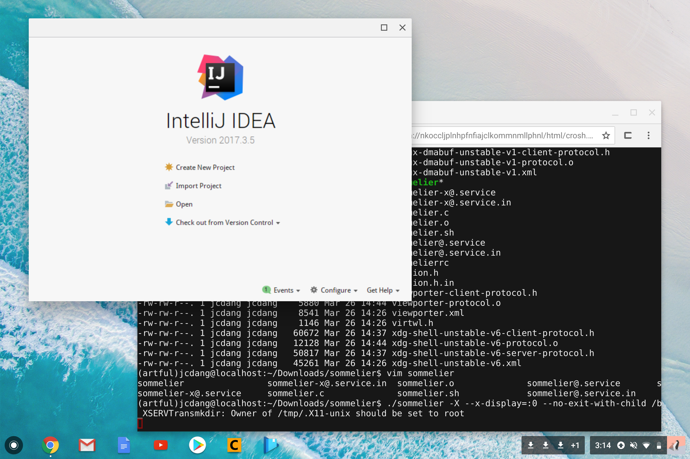

# Sommelier + Ubuntu + ChromeOS

## Prerequisites
Crouton installed

## Run Crouton
```bash
cd ~/Downloads/
sudo sh crouton -t cli-extra -r artful
```

## Log in
```bash
sudo enter-chroot
```

## Setup Environment Variables (might want to add to ~/.bashrc)
```bash
export GDK_BACKEND=wayland 
export CLUTTER_BACKEND=wayland
export XDG_RUNTIME_DIR='/var/run/chrome'
export WAYLAND_DISPLAY=wayland-0
export DISPLAY=:0
```

## Install Dependencies
```bash
sudo apt-get install -y pkg-config git make xwayland libwayland-dev libgbm-dev gcc libx11-xcb-dev libsystemd-dev libxcb-composite0-dev libxkbcommon-dev libxrender-dev libxtst-dev libpixman-1-dev
```

## Get and run Sommelier Service
```bash
git clone https://chromium.googlesource.com/chromiumos/containers/sommelier
cd sommelier
make
./sommelier -X --x-display=:0 --no-exit-with-child /bin/sh -c "./sommelierrc"
```

## Done!
You're ready to go! Open an app in another terminal.


